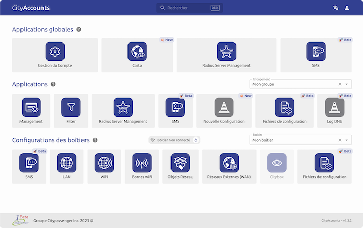
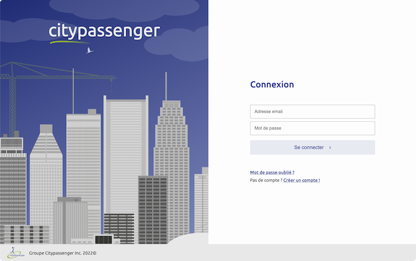
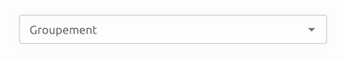
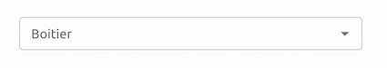
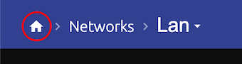
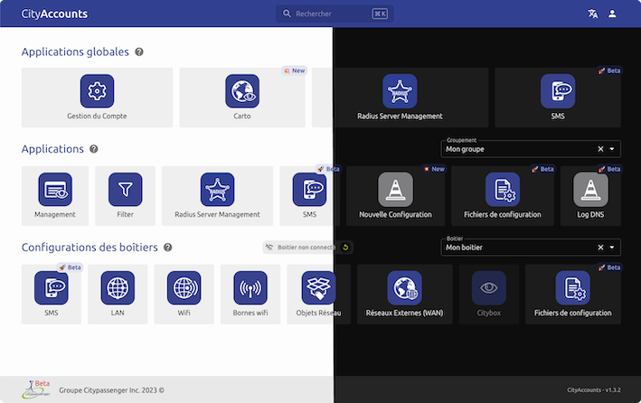

# Cityscope

Dépôt centrale des applications Citypassenger.

## ✨ Présentation

La nouvelle interface [Cityscope](admin.citypassenger.com) présente de manière érgonomique l'ensemble des fonctions réseaux de vos boitiers. Elles vous permet d'accèder en un clic aux applications qui vous sont utiles.

### Connexion

Pour accèder à Cityscope il est d'abord nécessaire de s'authentifier. Vous serez automatiquement redirigé vers la page de connexion lorsque cous tenterez d'accèder à l'interface.

Une fois connecté, vous pouvez vous déconnecter et vérifier votre email de connexion à tout moment en cliquant sur l'icone utilisateur à droite de l'en-tête.

### Navigation

#### Gestion du compte

L'application de gestion de compte permet de consulter les informations et d'effectuer des opérations sur son compte et ses groupes.

Elle est accessible depuis l'icone dédiée ou en cliquant sur votre email dans l'en-tête.

#### Sélection du groupe

Pour afficher les applications liés à un groupement de boitier il est nécessaire de sélectionner le groupement voulu dans la section dédiée à droite de l'interface. Si vous possédez un seul groupement il sera sélectionné par défaut.

#### Sélection du boitier

Pour afficher les applications liés à un boitier il est nécessaire de sélectionner le boitier voulu dans la section dédiée à droite de l'interface. Si vous possédez un seul botier il sera sélectionné par défaut.

#### Navigation entre les applications

Dans chacune des applications Cityscope il est possible de revenir à l'accueil en cliquant sur l'icône maison.

Dans certaines applications il est également possible de se servir de l'en tête pour naviguer.

### Multi-thème

L'interface Cityscope et l'ensemble des applications qui la composent sont disponibles en deux thèmes: clair et sombre.

Par défaut le thème est détécté en suivant les préférences de votre navigateur. Vous pouvez changer le thème à tout moment grâce à l'icone utilisateur situé à droite de l'en-tête.

### Multi-langue

L'interface Cityscope et l'ensemble des applications qui la composent sont disponibles en Francais et en Anglais. Par défaut la langue est détéctée en suivant les préférences de votre navigateur. Vous pouvez changer la langue à tout moment grâce à l'icone dédié situé à droite de l'en-tête.

## 🚩 Problèmes, questions et demandes

Si vous recontrez un problème ou avez une demande sur l'interface Cityscope, vous pouvez [créer une isssue](https://github.com/Groupe-Citypassenger-Inc/cityscope/issues). Renseigner-y un titre succint et une description décrivant au mieux votre problème / demande. Toute capture d'écran ou élément de contexte complémentaire est également le bienvenue.

Cela permettra aux équipes Citypassenger d'identifier votre besoin et de vous tenir informé de l'avancé de sa résolution.

Pensez également à consulter les issues déjà ouvertes pour éviter de créer des duplicats.